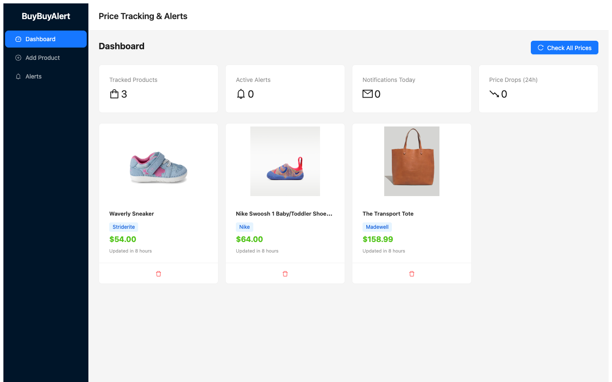
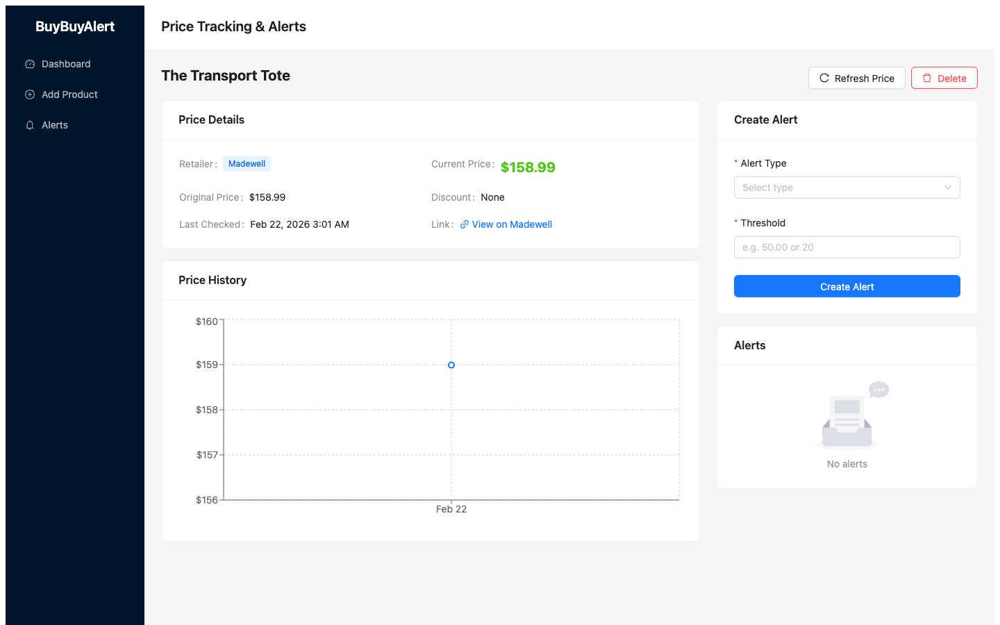

# BuyBuyAlert

Price tracking and alert app that monitors product prices across online retailers via web scraping, lets you create price/discount alerts, and sends email notifications when thresholds are met.

## Screenshots

### Dashboard


### Product Detail


## Features

- **Track any retailer** — Playwright headless browser with generic scraper (JSON-LD, meta tags, CSS selectors) works on most sites
- **Specialized Amazon scraper** — dual Playwright + requests fallback with anti-bot stealth
- **Price alerts** — `price_below` and `discount_pct` types with 24-hour cooldown
- **Email notifications** — HTML emails via Gmail SMTP with product details and links
- **Price history** — track price changes over time with interactive charts
- **Scheduled checks** — APScheduler daily cron job (configurable time)
- **Manual refresh** — check all prices or individual products on demand

## Supported Retailers

Works with any retailer that has product pages with structured data. Tested with:

- Amazon, Walmart, Target, Best Buy, Costco
- Nike, Nordstrom, Madewell
- Any site with JSON-LD Product schema, Open Graph price tags, or standard price CSS patterns

## Tech Stack

- **Backend:** FastAPI, SQLAlchemy, SQLite, Alembic, APScheduler, Playwright, BeautifulSoup
- **Frontend:** React 19, TypeScript, Ant Design, Recharts, Vite
- **Environment:** `paper_trading` conda env

## Setup

### 1. Configure email

Copy `.env.example` to `.env` and fill in your Gmail app password:

```bash
cp .env.example .env
```

```
SMTP_USER=your_email@gmail.com
SMTP_PASSWORD=your_app_password
ALERT_RECIPIENT=your_email@gmail.com
```

### 2. Install dependencies

```bash
conda activate paper_trading

# Backend
cd backend
pip install -e .

# Playwright browser
python -m playwright install chromium

# Frontend
cd ../frontend
npm install
```

### 3. Run database migrations

```bash
cd backend
alembic upgrade head
```

### 4. Start the app

```bash
./start.sh
```

- Frontend: http://localhost:5173
- Backend API docs: http://localhost:8000/docs

## API Endpoints

| Method | Path | Purpose |
|--------|------|---------|
| POST | `/api/products` | Add product by URL (scrapes immediately) |
| GET | `/api/products` | List all tracked products |
| GET | `/api/products/{id}` | Get product details |
| DELETE | `/api/products/{id}` | Delete product + alerts + history |
| POST | `/api/products/{id}/refresh` | Manual price refresh |
| GET | `/api/products/{id}/price-history` | Price time series |
| POST | `/api/products/{pid}/alerts` | Create alert |
| GET | `/api/products/{pid}/alerts` | List product alerts |
| GET | `/api/alerts` | List all alerts |
| PUT | `/api/alerts/{id}` | Update alert threshold/toggle |
| DELETE | `/api/alerts/{id}` | Delete alert |
| GET | `/api/notifications` | List recent notifications |
| GET | `/api/dashboard/summary` | Stats overview |
| POST | `/api/check-prices` | Manually trigger full price check |

## Project Structure

```
buybuyalert/
├── backend/
│   ├── app/
│   │   ├── main.py              # FastAPI app + lifespan
│   │   ├── config.py            # DB URL + SMTP settings
│   │   ├── database.py          # SQLAlchemy engine + session
│   │   ├── models.py            # products, price_history, alerts, notifications
│   │   ├── schemas.py           # Pydantic models
│   │   ├── scheduler.py         # APScheduler daily cron
│   │   ├── routers/             # API endpoints
│   │   ├── services/            # Business logic
│   │   └── scrapers/
│   │       ├── base.py          # Playwright fetch + generic scraper
│   │       ├── amazon.py        # Amazon-specific scraper
│   │       └── registry.py      # URL → scraper routing
│   └── alembic/                 # Database migrations
├── frontend/
│   └── src/
│       ├── pages/               # Dashboard, AddProduct, ProductDetail, Alerts
│       ├── components/          # ProductCard, PriceHistoryChart, AlertForm, etc.
│       ├── api/client.ts        # Axios API client
│       └── types/index.ts       # TypeScript interfaces
├── start.sh                     # Start backend + frontend
├── .env                         # SMTP credentials (gitignored)
└── .env.example
```
